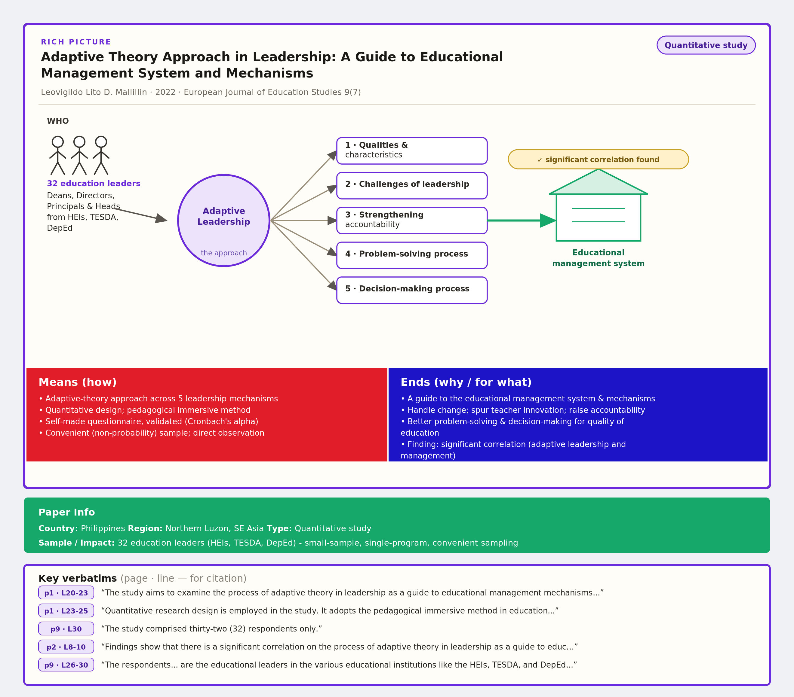

# Theta

**Turn a research PDF into a one-page, dyslexia-friendly "rich picture" card** — so you can grasp a paper's *meaning* at a glance, with **Means**, **Ends**, **Paper Info**, and **verbatim quotes carrying page + line numbers** for citation.

Built for fast triage and for feeding **systematic reviews / mass research**.



---

## Why

Reading dense papers is slow — especially with dyslexia. Theta renders every paper
into the **same** visual template, so your eye always knows where to look:

| Zone | Meaning |
|------|---------|
| Header | Title · authors · year · venue · **study-type chip** |
| RICH PICTURE | `WHO → CORE APPROACH → FACTORS/THEMES → OUTCOME` |
| Means (red) | *How* — design, method, sample, instruments |
| Ends (blue) | *Why / for what* — aims, outcomes, key finding |
| Paper Info (green) | Country · Region · Sample/Impact · Type |
| Key verbatims | Direct quotes with `p# · L#` for citation |

---

## Install

```bash
# 1) system dependency: pdftotext (poppler)
#    Ubuntu/Debian:  sudo apt-get install poppler-utils
#    macOS:          brew install poppler
#    Windows:        install poppler, add its \bin to PATH

# 2) python deps
pip install -r requirements.txt        # cairosvg (PNG preview)
pip install anthropic                  # only for the one-command AI mode
```

## Use

**One command (AI reads the paper for you):**
```bash
export ANTHROPIC_API_KEY=sk-...
python run.py paper.pdf
# -> paper.theta.svg  (+ paper.fields.json)
```

**No API key? Write the small JSON yourself (or tweak the AI's):**
```bash
python theta.py paper.pdf my.fields.json
```

**PNG preview:**
```bash
python -c "import cairosvg; cairosvg.svg2png(url='paper.theta.svg', write_to='paper.png', output_width=1320, output_height=1160)"
```

Open the `.svg` in a browser, or **drag it into FigJam/Figma** — it becomes fully
editable shapes and text.

---

## How automatic is it?

- **Fully automatic from the PDF** (`theta.py`): title, authors, year, venue, country,
  region, sample size, study type, and *candidate quotes with page + line numbers*.
- **Interpretive parts** (the diagram, Means, Ends): produced by the **AI reading step**
  (`ai_extract.py`) which fills `fields.json` — see `prompts/extract_prompt.md` and
  `fields.schema.json`. Everything after that is deterministic, so cards stay identical
  across hundreds of papers.

```
PDF ──pdftotext──► text + page/line index
        ├── deterministic extractor (theta.py) ──► metadata + candidate quotes
        └── AI reader (ai_extract.py) ──► fields.json ──► theta.py ──► card.svg
```

See `examples/` for two finished cards and their `fields.json`.

---

## Notes & roadmap

- **Line numbers** are Theta's own per-page line counts (consistent and reproducible,
  but not the publisher's printed numbers). Section/paragraph anchoring is on the roadmap.
- **PDFs are not redistributed** here for copyright reasons — bring your own.
- Roadmap: batch mode (folder → grid of cards + CSV review table), study-type/region
  colour sorting, OpenDyslexic + high-contrast theme, RIS/BibTeX export.

## License
MIT — see `LICENSE`.
